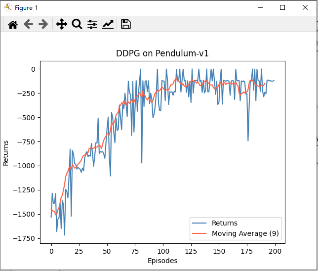

# DDPG on Pendulum-v1

This repo contains a minimal DDPG implementation for the Pendulum-v1 task and a simple training/evaluation entrypoint.

## Environment

- Python 3.8+
- PyTorch
- gymnasium (preferred) or gym (fallback)
- numpy, tqdm, matplotlib

## Install

```bash
pip install torch numpy tqdm matplotlib gymnasium
```

If you use gym (older installs), replace gymnasium with gym.

## Run

```bash
python ddpg_pendulum.py
```

Behavior:
- The script trains, plots the return curve, then evaluates with rendering.

## Results

The following curve is from a previous reproduction:



## Notes

- Default training is 200 episodes.
- You can edit hyperparameters inside `train()` in `ddpg_pendulum.py` if needed.
